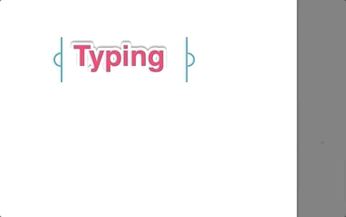
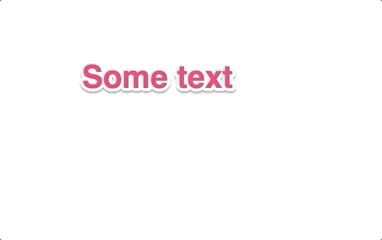
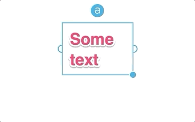

# Spec for TextAnnotation

Review this alongside the public [README](../README.md) which is part of this spec.

## Notes
- The visual style of the examples is not relevant - these are just taken from Skitch app. Just use the default font and keep the handles simple - visual designs will follow once the functionality is there.
- The examples are ordered by relevance - the resizing and scaling is optional in the beginning.
- Wherever reasonable write tests for the functionality.
- Main challenge is getting the automatic text box resizing to work reliably - a semi-working code snippet can be found here: https://gist.github.com/mirkokiefer/4d8f2c01aa0082d3b3b32a39a58862db
- A correct implementation of NSTextView's `intrinsicContentSize` is key.

## Examples

### Creating a text annotation
Click on the canvas to create a text annotation and start typing.
The width of the textbox dynamically expands. 

### Selecting and editing text
Click on a text annotation to select and double click to start editing.

### Multiple lines
Pressing enter should insert line breaks.

### Moving text
Move text by dragging it - selection should not be required.

### Auto-wrapping at end of canvas
Text should automatically break at the end of the canvas.

### Resizing the width
Resize with the handles at the sides.

### Scaling the text
Scale the text by dragging the resize handle.

